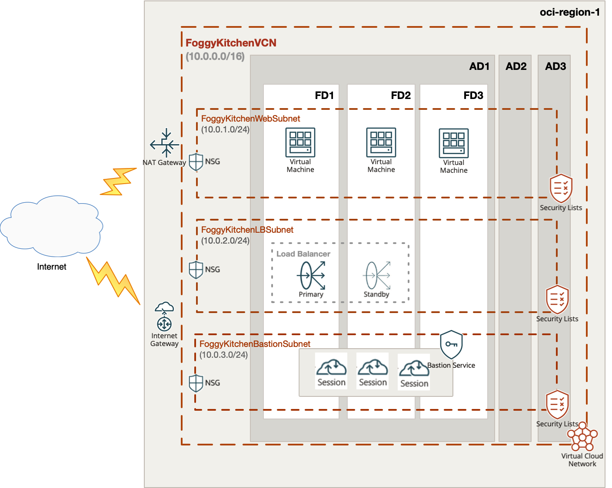

# Terraform OCI Flex Bastion Service

## Project description

In this repository I have documented my hands-on experience with Terrafrom for the purpose of OCI Bastion Service deployment (new OCI feature released and documented [_here_](https://docs.oracle.com/en-us/iaas/releasenotes/changes/e09405bc-6167-44c8-90b3-2639b4ad2591/) and now supported by OCI Terraform Provider v4.28.0). This set of HCL based Terraform files can customized according to any requirements.  

## Topology Diagram 

With the usage of this example HCL code you can build topology documented by diagram below. 



## How to use code 

### STEP 1.

Clone the repo from GitHub.com service by executing the command as follows and then go to terraform-oci-bastion-service directory:

```
[opc@terraform-server ~]$ git clone https://github.com/mlinxfeld/terraform-oci-bastion-service.git
Cloning into 'terraform-oci-bastion-service'...
remote: Enumerating objects: 45, done.
remote: Counting objects: 100% (45/45), done.
remote: Compressing objects: 100% (31/31), done.
remote: Total 45 (delta 19), reused 40 (delta 14), pack-reused 0
Unpacking objects: 100% (45/45), done.

[opc@terraform-server ~]$ cd terraform-oci-bastion-service/

[opc@terraform-server terraform-oci-bastion-service]$ ls -latr
total 1044
drwxr-xr-x  11 opc  opc      352 17 gru 09:49 .git
drwxr-xr-x   9 opc  opc      288 17 cze 11:15 .git
-rw-r--r--   1 opc  opc      185 17 cze 11:16 compartment.tf
-rw-r--r--   1 opc  opc  1173714 17 cze 11:16 terraform-oci-bastion-service.jpg
-rw-r--r--   1 opc  opc     1947 17 cze 11:28 lb.tf
-rw-r--r--   1 opc  opc     2234 17 cze 11:33 nsg.tf
-rwxr-xr-x   1 opc  opc     1233 17 cze 11:46 bastionservice.tf
-rw-r--r--   1 opc  opc      237 17 cze 11:47 outputs.tf
-rw-r--r--   1 opc  opc       80 17 cze 11:48 tls.tf
-rwxr-xr-x   1 opc  opc     1117 17 cze 11:48 compute.tf
-rw-r--r--   1 opc  opc     1488 17 cze 11:49 datasources.tf
drwxr-xr-x   3 opc  opc       96 17 cze 11:50 scripts
-rw-r--r--   1 opc  opc      204 17 cze 11:51 provider.tf
-rw-r--r--   1 opc  opc     1373 17 cze 11:54 remote.tf
-rw-r--r--   1 opc  opc     1313 17 cze 11:54 variables.tf
-rw-r--r--   1 opc  opc     3420 17 cze 11:54 network.tf
-rw-r--r--@  1 opc  opc    11778 17 cze 11:57 README.md
drwxr-xr-x  25 opc  opc      800 17 gru 09:58 .

```

### STEP 2.

Within web browser go to URL: https://www.terraform.io/downloads.html. Find your platform and download the latest version of your terraform runtime. Add directory of terraform binary into PATH and check terraform version:

```
[opc@terraform-server terraform-oci-bastion-service]$ export PATH=$PATH:/home/opc/terraform

[opc@terraform-server terraform-oci-bastion-service]$ terraform --version

Terraform v0.12.16

Your version of Terraform is out of date! The latest version
is 0.12.17. You can update by downloading from https://www.terraform.io/downloads.html
```

### STEP 3. 
Next create environment file with TF_VARs:

```
[opc@terraform-server terraform-oci-bastion-service]$ vi setup_oci_tf_vars.sh
export TF_VAR_user_ocid="ocid1.user.oc1..aaaaaaaaob4qbf2(...)uunizjie4his4vgh3jx5jxa"
export TF_VAR_tenancy_ocid="ocid1.tenancy.oc1..aaaaaaaas(...)krj2s3gdbz7d2heqzzxn7pe64ksbia"
export TF_VAR_compartment_ocid="ocid1.tenancy.oc1..aaaaaaaasbktyckn(...)ldkrj2s3gdbz7d2heqzzxn7pe64ksbia"
export TF_VAR_fingerprint="00:f9:d1:41:bb:57(...)82:47:e6:00"
export TF_VAR_private_key_path="/tmp/oci_api_key.pem"
export TF_VAR_region="eu-frankfurt-1"

[opc@terraform-server terraform-oci-bastion-service]$ source setup_oci_tf_vars.sh
```

### STEP 4.
Run *terraform init* with upgrade option just to download the lastest neccesary providers:

```
[opc@terraform-server terraform-oci-bastion-service]$ terraform init -upgrade


Initializing the backend...

Initializing provider plugins...
- Finding latest version of hashicorp/template...
- Finding latest version of hashicorp/null...
- Finding latest version of hashicorp/oci...
- Finding latest version of hashicorp/tls...
- Installing hashicorp/template v2.2.0...
- Installed hashicorp/template v2.2.0 (signed by HashiCorp)
- Installing hashicorp/null v3.1.0...
- Installed hashicorp/null v3.1.0 (signed by HashiCorp)
- Installing hashicorp/oci v4.31.0...
- Installed hashicorp/oci v4.31.0 (signed by HashiCorp)
- Installing hashicorp/tls v3.1.0...
- Installed hashicorp/tls v3.1.0 (signed by HashiCorp)

Terraform has created a lock file .terraform.lock.hcl to record the provider
selections it made above. Include this file in your version control repository
so that Terraform can guarantee to make the same selections by default when
you run "terraform init" in the future.

Terraform has been successfully initialized!

You may now begin working with Terraform. Try running "terraform plan" to see
any changes that are required for your infrastructure. All Terraform commands
should now work.

If you ever set or change modules or backend configuration for Terraform,
rerun this command to reinitialize your working directory. If you forget, other
commands will detect it and remind you to do so if necessary.commands will detect it and remind you to do so if necessary.
```

### STEP 5.
Run *terraform apply* to provision the content of this code (type **yes** to confirm the the apply phase):

```
[opc@terraform-server terraform-oci-bastion-service]$ terraform apply 

(...)

Terraform used the selected providers to generate the following execution plan. Resource actions are indicated with the following symbols:
  + create
 <= read (data resources)

Terraform will perform the following actions:

  # data.oci_core_vnic.FoggyKitchenWebserver_VNIC1[0] will be read during apply
  # (config refers to values not yet known)
 <= data "oci_core_vnic" "FoggyKitchenWebserver_VNIC1"  {
      + availability_domain    = (known after apply)
      + compartment_id         = (known after apply)
      + defined_tags           = (known after apply)
      + display_name           = (known after apply)
      + freeform_tags          = (known after apply)
      + hostname_label         = (known after apply)
      + id                     = (known after apply)
      + is_primary             = (known after apply)
      + mac_address            = (known after apply)
      + nsg_ids                = (known after apply)
      + private_ip_address     = (known after apply)
      + public_ip_address      = (known after apply)
      + skip_source_dest_check = (known after apply)
      + state                  = (known after apply)
      + subnet_id              = (known after apply)
      + time_created           = (known after apply)
      + vlan_id                = (known after apply)
      + vnic_id                = (known after apply)
    }

(...)

  # tls_private_key.public_private_key_pair will be created
  + resource "tls_private_key" "public_private_key_pair" {
      + algorithm                  = "RSA"
      + ecdsa_curve                = "P224"
      + id                         = (known after apply)
      + private_key_pem            = (sensitive value)
      + public_key_fingerprint_md5 = (known after apply)
      + public_key_openssh         = (known after apply)
      + public_key_pem             = (known after apply)
      + rsa_bits                   = 2048
    }

Plan: 30 to add, 0 to change, 0 to destroy.

Changes to Outputs:
  + FoggyKitchenFlexPublicLoadBalancer_Public_IP = [
      + (known after apply),
    ]
  + FoggyKitchenWebserver_PrivateIP              = [
      + [
          + (known after apply),
          + (known after apply),
        ],
    ]
  + bastion_ssh_metadata                         = [
      + (known after apply),
      + (known after apply),
    ]

Do you want to perform these actions?
  Terraform will perform the actions described above.
  Only 'yes' will be accepted to approve.

  Enter a value: yes

tls_private_key.public_private_key_pair: Creating...
tls_private_key.public_private_key_pair: Creation complete after 0s [id=b3ccdb0167c728cc743170dc94bea9fd681360d6]

(...)
oci_load_balancer_backend.FoggyKitchenFlexPublicLoadBalancerBackend1: Still creating... [1m40s elapsed]
oci_load_balancer_backend.FoggyKitchenFlexPublicLoadBalancerBackend1: Creation complete after 1m44s [id=loadBalancers/ocid1.loadbalancer.oc1.iad.aaaaaaaakwlpakwhgolzbztt5df6wsgwc7umso7paii36t7dw2bsecgz7vba/backendSets/FoggyKitchenFlexLBBackendset/backends/10.0.1.3:80]

Apply complete! Resources: 27 added, 0 changed, 0 destroyed.

Outputs:

FoggyKitchenBastionServer_PublicIP = [
  "150.136.64.117",
]
FoggyKitchenFlexPublicLoadBalancer_Public_IP = [
  [
    "193.122.204.3",
  ],
]
FoggyKitchenWebserver1_PrivateIP = [
  "10.0.1.3",
]
FoggyKitchenWebserver2_PrivateIP = [
  "10.0.1.2",
]
(...)

```

### STEP 6.
After testing the environment you can remove the whole OCI infra. You should just run *terraform destroy* (type **yes** for confirmation of the destroy phase):

```
[opc@terraform-server terraform-oci-bastion-service]$ terraform destroy

data.oci_identity_availability_domains.ADs: Refreshing state... [id=IdentityAvailabilityDomainsDataSource-3269541301]
oci_identity_compartment.FoggyKitchenCompartment: Refreshing state... [id=ocid1.compartment.oc1..aaaaaaaayxvhhjidfxsq35muvshgxv62ac2mn6mi2yo2xqzsq53jgkuozfwq]
data.oci_core_images.OSImageLocal: Refreshing state... [id=CoreImagesDataSource-3030678454]
oci_core_virtual_network.FoggyKitchenVCN: Refreshing state... [id=ocid1.vcn.oc1.iad.amaaaaaanlc5nbyatfsremzrq5agy2b5v7deja54rmtrqfbv2p5wc6s3prrq]
oci_core_network_security_group.FoggyKitchenWebSecurityGroup: Refreshing state... [id=ocid1.networksecuritygroup.oc1.iad.aaaaaaaalkzj5i2btyqde3jafj4o5zxbrr6v3bdt5rw5gqtcgyff3xq2xcma]
oci_core_internet_gateway.FoggyKitchenInternetGateway: Refreshing state... [id=ocid1.internetgateway.oc1.iad.aaaaaaaawwzbcubzr6dac2xcsraauglsvaokqcpov54qnw7or4qeey46eyta]
oci_core_network_security_group.FoggyKitchenSSHSecurityGroup: Refreshing state... [id=ocid1.networksecuritygroup.oc1.iad.aaaaaaaa2sg4voivred6m24eqrnr26e62fpykuslpttcfo2tdmfq5pdlgqwq]
(...)

  # oci_load_balancer_listener.FoggyKitchenFlexPublicLoadBalancerListener will be destroyed
  - resource "oci_load_balancer_listener" "FoggyKitchenFlexPublicLoadBalancerListener" {
      - default_backend_set_name = "FoggyKitchenFlexLBBackendset" -> null
      - hostname_names           = [] -> null
      - id                       = "loadBalancers/ocid1.loadbalancer.oc1.iad.aaaaaaaakwlpakwhgolzbztt5df6wsgwc7umso7paii36t7dw2bsecgz7vba/listeners/FoggyKitchenFlexLBListener" -> null
      - load_balancer_id         = "ocid1.loadbalancer.oc1.iad.aaaaaaaakwlpakwhgolzbztt5df6wsgwc7umso7paii36t7dw2bsecgz7vba" -> null
      - name                     = "FoggyKitchenFlexLBListener" -> null
      - port                     = 80 -> null
      - protocol                 = "HTTP" -> null
      - rule_set_names           = [] -> null
      - state                    = "SUCCEEDED" -> null

      - connection_configuration {
          - backend_tcp_proxy_protocol_version = 0 -> null
          - idle_timeout_in_seconds            = "60" -> null
        }
    }

Plan: 0 to add, 0 to change, 27 to destroy.

Changes to Outputs:
  - FoggyKitchenBastionServer_PublicIP           = [
      - "150.136.64.117",
    ] -> null
  - FoggyKitchenFlexPublicLoadBalancer_Public_IP = [
      - [
          - "193.122.204.3",
        ],
    ] -> null
  - FoggyKitchenWebserver1_PrivateIP             = [
      - "10.0.1.3",
    ] -> null
  - FoggyKitchenWebserver2_PrivateIP             = [
      - "10.0.1.2",
    ] -> null

Do you really want to destroy all resources?
  Terraform will destroy all your managed infrastructure, as shown above.
  There is no undo. Only 'yes' will be accepted to confirm.

  Enter a value: yes

(...)

oci_core_nat_gateway.FoggyKitchenNATGateway: Destroying... [id=ocid1.natgateway.oc1.iad.aaaaaaaadabtkqy4t3psmn64jwmdmnh73htb4ntjkuunjjh7spgj26iiempq]
oci_core_nat_gateway.FoggyKitchenNATGateway: Destruction complete after 2s
oci_core_virtual_network.FoggyKitchenVCN: Destroying... [id=ocid1.vcn.oc1.iad.amaaaaaanlc5nbyatfsremzrq5agy2b5v7deja54rmtrqfbv2p5wc6s3prrq]
oci_core_virtual_network.FoggyKitchenVCN: Destruction complete after 1s
oci_identity_compartment.FoggyKitchenCompartment: Destroying... [id=ocid1.compartment.oc1..aaaaaaaayxvhhjidfxsq35muvshgxv62ac2mn6mi2yo2xqzsq53jgkuozfwq]
oci_identity_compartment.FoggyKitchenCompartment: Destruction complete after 0s

Destroy complete! Resources: 27 destroyed.
```
